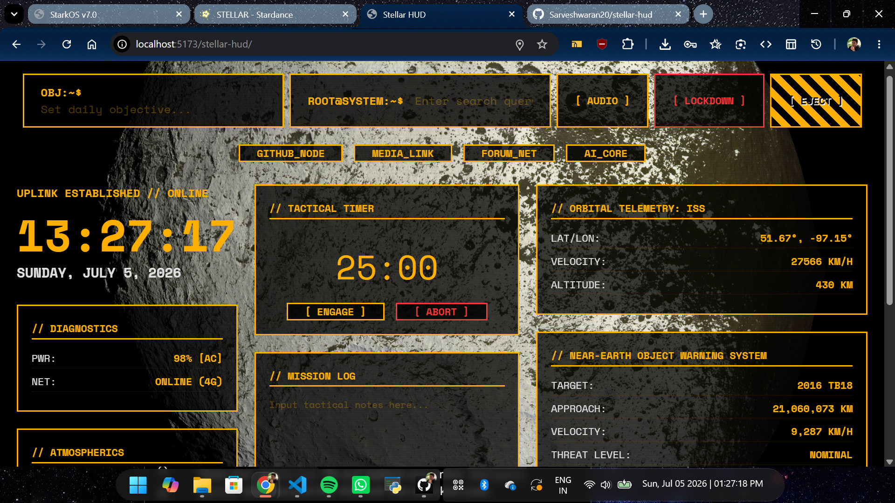

This repository contains the complete frontend codebase for StarkOS v7.0, an interactive web-based desktop environment styled with a high-contrast, tactical cyberpunk aesthetic. The platform integrates real-time telemetry readouts, dynamic multi-window manipulation systems, core diagnostic tools, and an automated background script companion.

🛠️ Core Functional Architecture
📡 Mainframe HUD Display
Dynamic 24h Clock: Parses and renders real-time military timestamps locally at the display center.

Satellite Weather Sync: Leverages native browser Geolocation coordinates to query real-time local temperature and atmospheric updates via the OpenWeather API framework.

Concentric Telemetry Rings: Features layered, CSS-animated rotating rings to complete the background telemetry aesthetic.

💻 System Application Matrix
J.A.R.V.I.S. Mainframe Shell: A central command console terminal that handles application threads, text output logs, and standalone brute-force vault decryption scripts.

Secure Notes Logs: A persistent text repository utilizing client-side local database storage hooks. Includes direct script functions to export stored strings down to native text documents.

Blueprint Schematic Canvas: A local image-loading workbench supporting canvas-driven visual filters (Hologram, Nightvision, and Warning configurations).

Recon Media Feed: An asynchronous sandboxed visual frame utilizing standard embed configurations.

Neural Snake Arcade: An isolated canvas grid gaming environment configured to process key events separately from primary OS rendering cycles.

⏱️ Integrated Operational Payloads
Tactical Timer: A precise standalone execution countdown module built with basic operational toggle controls ([ ENGAGE ] and [ ABORT ]).

System Diagnostics: Queries system APIs asynchronously to provide real-time connection status feeds and battery health updates.

Audio Link Node: A localized media mounting engine that plays audio tracking assets directly via the client machine without external API validation requirements.

System Calculator: An arithmetic processing grid optimized to match the visual footprint of the mainframe interface windows.

👾 Malware Spirit Companion
Dock Pacing Automation: An animated script assistant designed to pace smoothly across the bottom taskbar boundary vectors. The coordinate bounds are strictly constrained to prevent menu clashing or overlapping icon elements.

Idle Sleep Routines: Monitors active mouse and keyboard input events to shift the character into a low-glow breathing state after 45 seconds of system inactivity.

Speech Feedback Loop: Generates dynamic text bubbles and terminal tooltips contextually aligned with resource hunger calculations.

⌨️ J.A.R.V.I.S. Console Dictionary
Open the central J.A.R.V.I.S. Mainframe Terminal window and input the following case-insensitive command keys to trigger system events:

help - Retrieves the active index of authorized operational console command flags.

open logs - Initializes the secure documentation log application window.

open schematics - Displays the photo canvas workspace and filter array panel.

open media - Renders the media video reconnaissance panel.

play snake - Boots up the arcade neural collision canvas board.

decrypt vault - Triggers a brute-force mathematical puzzle requiring numeric crypt verification keys.

protocol 84 - Engages an emergency overlay layout accompanied by a critical self-destruct sequence.

close all - Shuts down every active sub-window layout panel simultaneously.

clear - Wipes all previously printed terminal lines from the current screen buffer.

