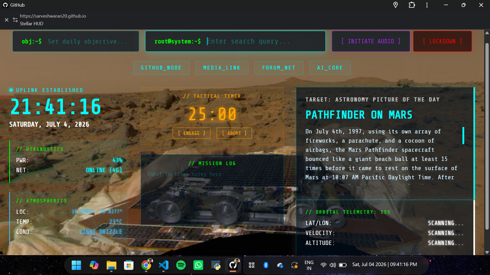

# Stellar HUD
A sci-fi-inspired browser dashboard that tracks live orbital telemetry, atmospheric data, and system diagnostics to turn your new tab page into a tactical command center.



### 🚀 [Launch the Live Command Center Here](https://sarveshwaran20.github.io/stellar-hud/)

---

## ⚡ Quick Start
To use the live version immediately, just open the link above and set it as your browser's homepage or new tab URL. 

*Note: Allow location permissions when prompted so the environmental sensors can pull your local weather data.*

---

## 🛰️ Features
* **Real-Time ISS Tracking:** Scrapes and displays the exact latitude, longitude, velocity, and altitude of the International Space Station, updating every 3 seconds.
* **Hardware & Atmospheric Sensors:** Taps into native browser APIs to display live laptop battery and network connection status, alongside local weather pulled via GPS.
* **Tactical Focus Core:** Includes a 25-minute Pomodoro countdown timer and a persistent, auto-saving mission log for daily objectives.
* **Deep Space Comms:** A built-in audio receiver that streams ambient space music directly from SomaFM's *Deep Space One*.
* **NASA APOD Integration:** Automatically fetches the daily Astronomy Picture of the Day and renders it as the background with its official telemetry description.
* **System Lockdown:** A manual safety switch that triggers a global CSS-driven red-alert state, flashing the entire interface crimson.

---

## 🛠️ How to run it locally

If you want to run the project locally or modify the source code, you'll need **Node.js (v18+)**.

1. **Clone and install dependencies:**
```bash
git clone [https://github.com/sarveshwaran20/Stellar-HUD.git](https://github.com/sarveshwaran20/Stellar-HUD.git)
cd Stellar-HUD
npm install
